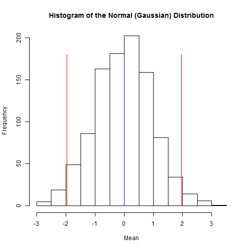

## Introduction

* The normal distribution is found throughout nature and is without a doubt the most "famous" of all distributions.

* Fun Fact: If you take replicate measurements from any distribution, the replicate values will exhibit a normal distribution even if the distribution of the data set as a whole is from another distribution.


---

## Exploring the Normal Distribution

* The normal distribution is also known as the Gaussian after Carl Friedrich Gauss.

* Specifying the Parameters to Gaussian Explorer
  * It is defined by two parameters, mu and sigma which represent the mean and standard deviation respectively.
  * To visualize the distribution, you will also need to specify the number of variates that you would like to see displayed as well as the number of bins that you would like the histogram to be broken into.
* Graphical Elements
 * The mean is indicated by a blue line
 * The 95% confidence region is indicated by red lines
 * The height of the bars is scaled to 1.5 times the most frequent bin for aesthetic reasons.

---

## Exploration Number 1 - The Standard Normal Distribution

* The Standard Normal Distribution
 * The standard normal distribution is defined by mu = 0 and sigma = 1
 * Enter these values in Gaussian Explorer along with appropriate numbers for variates and bins
 * Your result should look something like the histogram below


```r
mu <- 0
variates <- 1000
sigma <- 1
bins <- 20

x <- rnorm(variates, mu, sigma)
height <- max(table(cut(x, bins)))

hist(rnorm(variates, mu, sigma), breaks = bins, xlab = "Mean", main = "Histogram of the Normal (Gaussian) Distribution")
lower <- qnorm(0.025, mu, sigma, lower = TRUE)
upper <- qnorm(0.975, mu, sigma, lower = TRUE)

lines(c(lower, lower), c(0, 1.5 * height), col = "red", lwd = 1)
lines(c(upper, upper), c(0, 1.5 * height), col = "red", lwd = 1)
lines(c(mu, mu), c(0, 1.5 * height), col = "blue", lwd = 1)
```

 


---

## Exploration Number 2 - Effects of Binning

* Bin size can have (sometimes undesirable) effects on the shape of a distribution.
 * Set the bins to 500 
 * You can leave the variates set to 1000
 * Experiment with fewer than 500 bins. Note that the characteristic bell-shape begins to break down long before the number of bins reaches one half of the number of variates.


## Exploration Number 3 - How Standardization Works

* Any normal distribution can be "standardized" by subtracting the mean and dividng by the standard deviation.
 * Reset the mu to 0 and sigma to 1 if necessary
 * Behold the standard normal distribution. If the distribution does not appear bell shaped, then increase the number of variates to 1000 and the number of bins to 20.
 * Observe that the distribution can be shifted to the right (or left) by increasing (or decreasing) mu; by subtrating mu from a distribution, the distribution will be centred arond zero. The spread of the distribution can be increased or decreased by correspondingly increasing or decreasing sigma; divinding by sigma will scale the standard deviation to 1.

